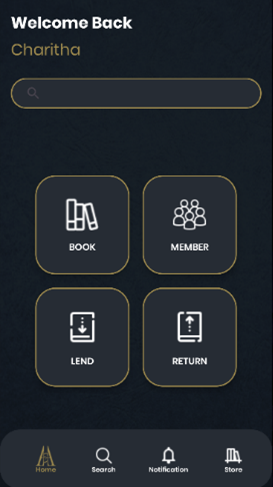

# 📚 Library Management App


## 📖 Description

Public Library is a comprehensive library management application designed and developed using **Android Studio, Java, and SQLite database**. It serves as a robust platform for managing library resources efficiently, providing a seamless experience for both librarians and library patrons.

## 🖼 Demo 




## ✨ Key Features

- 🔐 **User Authentication:** Enables user registration and login functionalities, ensuring secure access to the app's features.
- 📚 **Book Management:** Allows librarians to add, view, update, and delete book records, providing a centralized repository for managing library collections.
- 👥 **Member Management:** Facilitates the management of library members, enabling librarians to maintain accurate member records.
- 📖 **Book Reservation System:** Empowers users to reserve books, ensuring availability and facilitating a smooth borrowing process.
- 🔄 **Book Returning System:** Streamlines the book return process, helping librarians track borrowed items and manage inventory effectively.

## 🚀 Getting Started

To get started with Public Library, follow these steps:

### 📥 Clone the Repository
```sh
git clone https://github.com/CharithaAdikari/Library-Management-App-Android
```

### 🛠 Open in Android Studio
- Open **Android Studio** and import the project by selecting the cloned repository directory.

### ▶️ Build and Run
- **Build** the project in Android Studio and **run** it on an emulator or a physical device.


